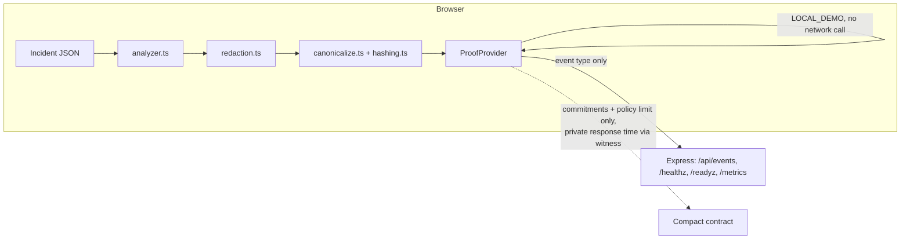

# ProofOps

Privacy-Preserving Incident Verification for SRE and Security Teams

Analyze incident evidence in the browser, evaluate a containment-time policy, and
generate a receipt without uploading raw production logs.

Stack: TypeScript · Node.js · Express · Docker · Vitest · GitHub Actions · Prometheus-compatible metrics

Implementation status: the default flow produces a `LOCAL_DEMO` receipt.
The Compact contract compiles and has simulator tests; wallet integration,
on-chain submission, and live network deployment are not implemented.

## Production Engineering

| Capability | Implementation |
|---|---|
| Liveness | `/healthz` exposes service status and uptime |
| Readiness reporting | `/readyz` reports whether the frontend build exists |
| Metrics | Prometheus-compatible `/metrics` and fixed event-type counters |
| Logging | Structured JSON application logs |
| Shutdown | SIGTERM/SIGINT handling with a 10-second timeout |
| Container runtime | Multi-stage non-root Docker image with a health check |
| CI | Typecheck, lint, test, and build gates |
| Operations | [Recovery runbook](docs/RUNBOOK.md) for health, build, provider, and verification failures |

The Express service serves the frontend and operational telemetry. Incident
analysis remains in the browser; the event endpoint accepts a fixed event type
rather than incident evidence.

Readiness scope: `/readyz` currently returns HTTP 200 even when its JSON status
is `degraded`, and its provider flag does not probe network dependencies. This MVP
does not yet provide a dependency-aware readiness gate.

## The problem

SRE and security teams routinely need to prove, to a customer or an auditor, that:

1. A security incident was detected.
2. A response policy was evaluated.
3. The incident was contained within the required time.
4. The evidence has not been modified since.

Raw AWS, Elastic, and application logs cannot normally be shared externally - they contain
account IDs, IAM role ARNs, usernames, emails, source/private IP addresses, access keys,
and session tokens. Today the usual answer is "trust us" or a manually redacted (and
manually trustworthy) PDF.

## Why privacy matters here

The verifier needs to confirm the *result* (detected, policy satisfied, contained in time)
without needing to see - or be trusted with - the *evidence*. That is a textbook case for
commitments and, eventually, zero-knowledge proofs: prove a property of private data
without revealing the data.

## How ProofOps works

1. Analyze locally. The incident JSON is parsed and run through a deterministic
   detection rule entirely in the browser. Nothing is uploaded.
2. Redact. A recursive, case-insensitive redaction pass masks known-sensitive fields
   for side-by-side comparison with the original.
3. Commit. The evidence is canonicalized (stable key ordering) and SHA-256 hashed via
   the Web Crypto API - the same logical document always produces the same commitment.
4. Evaluate policy. Response time (detection -> containment) is checked against a
   15-minute containment policy.
5. Generate a receipt. A small, typed `VerificationReceipt` - commitments, rule ID,
   policy result, provider, status - is produced. In this build that's a `LOCAL_DEMO`
   receipt by default; a Compact contract exists and is compiled/tested against the real
   Midnight toolchain for the on-chain path (see below).
6. Verify. Anyone holding the receipt and a copy of the evidence can recompute the
   commitment and confirm nothing changed - or watch it fail the instant one field is
   tampered with.

## Architecture



See [`docs/ARCHITECTURE.md`](docs/ARCHITECTURE.md) for the full trust-boundary diagram and
data flow.

## Local setup

Requires Node.js 20.19+ and npm.

```powershell
npm install
npm run dev
```

This starts the Vite dev server (`http://localhost:5173`) and the Express API
(`http://localhost:8787`) together, with `/healthz`, `/readyz`, `/metrics`, and
`/api/events` proxied through Vite. Works the same way in Windows PowerShell, Git Bash, or
a Linux/macOS shell - no shell-specific scripts are used.

Production build and run:

```powershell
npm run build
npm start
```

## Docker

```powershell
docker compose up --build
```

Serves the app at `http://localhost:8787` with `/healthz`, `/readyz`, and `/metrics`
available immediately. The default profile is local-demo only - it does not require
or start any Midnight network infrastructure.

## Tests

```powershell
npm test              # unit tests (Vitest)
npm run test:coverage # with coverage
npm run check          # typecheck + lint + test + build
```

Contract tests (require the real Compact toolchain; auto-delegates to WSL on Windows -
see [`docs/MIDNIGHT_STATUS.md`](docs/MIDNIGHT_STATUS.md)):

```powershell
npm run contract:build
npm run contract:test
```

## Switching providers

Set in `.env` (copy from `.env.example`):

```dotenv
VITE_PROOF_PROVIDER=local     # default - always works, no wallet/network needed
VITE_PROOF_PROVIDER=midnight  # requires a configured, reachable Midnight environment
```

The active mode is always visible in the UI as a `LOCAL DEMO MODE` or `MIDNIGHT NETWORK`
badge. A local receipt is never labeled as an on-chain proof.

## Current Midnight integration status

Real and verified: the Compact contract (`contract/src/proofops.compact`) compiles
with the official Compact compiler (0.31.1) and passes simulator tests against the real
`@midnight-ntwrk/compact-runtime` (0.16.0) - see `contract/README.md` and
[`docs/MIDNIGHT_STATUS.md`](docs/MIDNIGHT_STATUS.md) for exact versions, commands, and a
Windows-specific finding (no official Windows binary; this repo auto-delegates to WSL).

Not implemented / not real: on-chain transaction submission, wallet integration, and
any live devnet/testnet deployment. `MidnightProofProvider` performs a real network
reachability check but throws an explicit error on receipt creation rather than
fabricating a transaction ID - see the same status doc for the honest reason why.

## Demo flow

See [`docs/DEMO_SCRIPT.md`](docs/DEMO_SCRIPT.md) for a full 3-minute walkthrough: load the
bundled EC2 IMDS credential-theft incident, analyze it, inspect the redaction, generate a
receipt, verify it, then tamper with one field and watch verification fail.

## Privacy guarantees

- Raw evidence is never sent to the Express server or any third party.
- The evidence commitment is a SHA-256 hash. It detects changes when recomputed;
  it does not encrypt evidence or prevent guessing predictable inputs.
- The Compact contract's private response time is a `witness` value used only inside an
  `assert` - it is never disclosed to public ledger state.
- Metrics and server logs never contain incident content (see `docs/THREAT_MODEL.md`).

## Limitations

- Redaction is key-name based, not content-based - see `docs/THREAT_MODEL.md` for the
  specific limitation found and fixed during development.
- `LOCAL_DEMO` receipts are not zero-knowledge proofs and are not on-chain.
- One detection rule, one bundled scenario, no authentication, no database - by design,
  for a hackathon MVP.

## Future work

- Wire `MidnightProofProvider` to a real wallet + deployed contract + proof server.
- Additional detection rules beyond `AWS-IMDS-ROLE-USE-001`.
- Content-aware (not just key-name-based) redaction.
- Multi-receipt / multi-incident history instead of "latest receipt only."

## Hackathon track relevance

ProofOps is a direct application of Midnight's core value proposition - proving a fact
about private data without revealing the data - to a concrete, everyday SRE/security
workflow (incident response attestation) that currently has no good privacy-preserving
answer.

