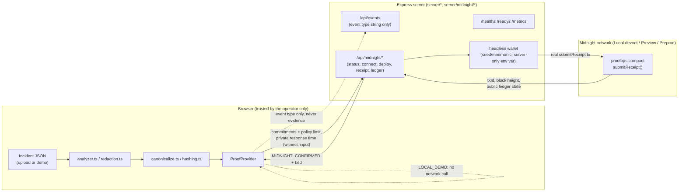
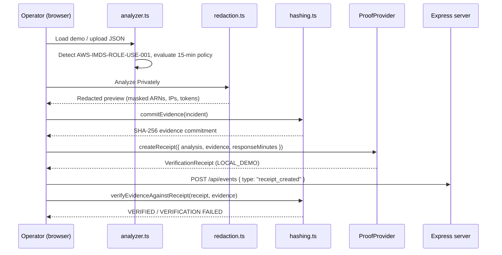

# ProofOps Architecture

## Overview

ProofOps is split into four layers with a hard trust boundary between the first and the
rest:

1. **Browser-local evidence engine** (`src/lib/*`, `src/types/*`) - the only layer that
   ever sees raw incident evidence. Runs entirely client-side.
2. **Express operational layer** (`server/*`) - serves the built frontend and exposes
   health/readiness/metrics. Never receives incident evidence.
3. **Client-side provider abstraction** (`src/midnight/*`) - `ProofProvider` interface
   selecting `LocalDemoProofProvider` or `MidnightProofProvider` (which talks only to this
   app's own `/api/midnight/*` endpoints, never to Midnight infrastructure directly - see
   below for why).
4. **Real Midnight integration** (`contract/*`, `server/midnight/*`) - a real headless
   wallet, real contract deploy/join, and real `submitReceipt` transaction submission
   against Local devnet, Preview, or Preprod. Runs server-side only.

## Browser-local evidence processing

All of incident validation, detection, redaction, canonicalization, and hashing
(`src/lib/validation.ts`, `analyzer.ts`, `redaction.ts`, `canonicalize.ts`, `hashing.ts`)
run in the browser using the Web Crypto API (`crypto.subtle.digest`). The uploaded or
demo-loaded JSON never leaves `App.tsx`'s in-memory state - it is not sent to
`server/*`, not written to `localStorage`, and not included in any network request other
than the one-time fetch of the bundled sample file itself.

## Canonicalization and hashing

`src/lib/canonicalize.ts` produces a deterministic string for any JSON value (sorted
object keys, preserved array order, consistent primitive serialization). `hashing.ts`
SHA-256-hashes the UTF-8 bytes of that string. This guarantees:

- The same logical document hashes identically regardless of source key order.
- Any meaningful change to the evidence changes the hash.

This is the mechanism behind both the "Evidence commitment" shown after analysis and the
tamper-detection demo in the Verify panel.

## Provider abstraction

`src/midnight/ProofProvider.ts` defines a single interface (`getStatus`, `createReceipt`,
`verifyReceipt`, plus optional `connectWallet`/`deployContract`) implemented by:

- `LocalDemoProofProvider` - always available, produces `LOCAL_DEMO` receipts, never
  claims to generate a ZK proof or touch a chain.
- `MidnightProofProvider` - calls this app's own `/api/midnight/*` endpoints
  (`server/midnightRoutes.ts`) to connect a wallet, deploy/join a contract, submit a real
  `submitReceipt` transaction, and independently re-query the ledger. It never fabricates
  a transaction ID, contract address, or `MIDNIGHT_CONFIRMED` status - those only ever
  come from a real server response after real network confirmation (see
  `docs/MIDNIGHT_STATUS.md`).

`src/midnight/providerFactory.ts` selects the active provider from
`VITE_PROOF_PROVIDER`, defaulting to `local` so the app is always demoable.

**Why the browser never talks to Midnight directly:** `VITE_*` env vars (and anything a
browser-side module does) are inlined into the public bundle - a wallet seed/mnemonic must
never live there. `server/midnight/*` holds the real wallet (via
`@midnight-ntwrk/testkit-js`'s headless `FluentWalletBuilder`) and the real
`@midnight-ntwrk/midnight-js-contracts` deploy/call code, configured via plain
(non-`VITE_`) server-side env vars. The browser only ever sees public results: network
name, contract address, transaction ID, confirmation status, and ledger state.

## Express operational layer

`server/app.ts` is a small, dependency-light Express app: static file serving for the
built frontend, `/healthz`, `/readyz`, `/metrics` (Prometheus text format), and
`/api/events` - a best-effort relay that increments server-side counters from a fixed
enum of event type strings only (`receipt_created`, `verification_run`,
`verification_failed`). `server/index.ts` wires graceful shutdown on `SIGTERM`/`SIGINT`.

## Midnight contract boundary

`contract/src/proofops.compact` defines the public ledger fields (commitments and policy
result only) and a `witness`-based private response time used solely inside an `assert`.
It is compiled with the real Compact compiler and tested with the real
`@midnight-ntwrk/compact-runtime` simulator (`contract/tests/`).

`contract/src/index.ts` wraps the compiled contract with `@midnight-ntwrk/compact-js`'s
`CompiledContract` (tag, witnesses, compiled-assets path) for consumption by the real
`@midnight-ntwrk/midnight-js-contracts` deploy/call APIs. `contract/` is a separate npm
package (its own `node_modules`, used for the WSL-only Compact compiler toolchain and
offline simulator tests) - it deliberately has **no dependency of its own** on
`@midnight-ntwrk/midnight-js-protocol` or `compact-runtime`; both are resolved from the
repository root instead. Two physically separate installations of the same package version
still produce two separate WASM/Effect module instances that cannot recognize each other's
branded objects - this was a real bug hit and fixed during this integration (see
`docs/MIDNIGHT_DEPLOYMENT.md`).

`server/midnight/*` is the real, server-side network integration: `config.ts` (network
endpoints + wallet secret resolution), `wallet.ts` (headless `FluentWalletBuilder`-based
wallet), `providers.ts` (`MidnightProviders`: private state, public data/indexer, ZK
config, proof), `deploy.ts` (deploy/join), `receipt.ts` (submit + read ledger), and
`session.ts` (a lazily-initialized, process-wide session so wallet sync only happens
once). `server/midnightRoutes.ts` exposes this to the browser as `/api/midnight/status`,
`/connect`, `/deploy`, `/receipt`, `/ledger` - see `docs/MIDNIGHT_STATUS.md` for exact
versions and current Preprod status.

## Trust boundaries

## Data flow (happy path)

