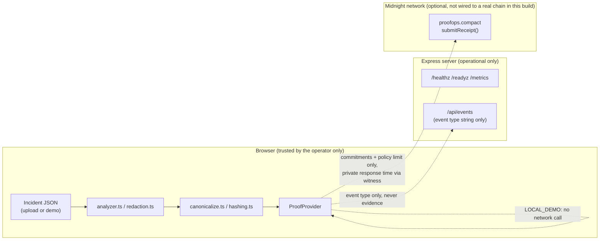
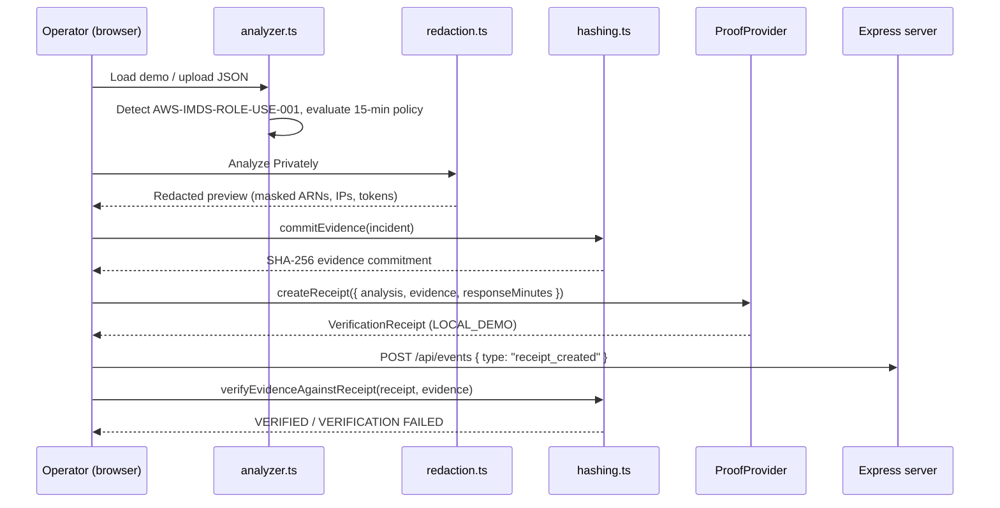

# ProofOps Architecture

## Overview

ProofOps is split into three layers with a hard trust boundary between the first and the
other two:

1. **Browser-local evidence engine** (`src/lib/*`, `src/types/*`) - the only layer that
   ever sees raw incident evidence. Runs entirely client-side.
2. **Express operational layer** (`server/*`) - serves the built frontend and exposes
   health/readiness/metrics. Never receives incident evidence.
3. **Midnight contract boundary** (`contract/*`, `src/midnight/*`) - the (optional) path
   to an actual privacy-preserving proof on a real network, behind a provider
   abstraction so the rest of the app does not care which implementation is active.

## Browser-local evidence processing

All of incident validation, detection, redaction, canonicalization, and hashing
(`src/lib/validation.ts`, `analyzer.ts`, `redaction.ts`, `canonicalize.ts`, `hashing.ts`)
run in the browser using the Web Crypto API (`crypto.subtle.digest`). The uploaded or
demo-loaded JSON never leaves `App.tsx`'s in-memory state - it is not sent to
`server/*`, not written to `localStorage`, and not included in any network request other
than the one-time fetch of the bundled sample file itself.

## Canonicalization and hashing

`src/lib/canonicalize.ts` produces a deterministic string for any JSON value (sorted
object keys, preserved array order, consistent primitive serialization). `hashing.ts`
SHA-256-hashes the UTF-8 bytes of that string. This guarantees:

- The same logical document hashes identically regardless of source key order.
- Any meaningful change to the evidence changes the hash.

This is the mechanism behind both the "Evidence commitment" shown after analysis and the
tamper-detection demo in the Verify panel.

## Provider abstraction

`src/midnight/ProofProvider.ts` defines a single interface (`getStatus`, `createReceipt`,
`verifyReceipt`) implemented by:

- `LocalDemoProofProvider` - always available, produces `LOCAL_DEMO` receipts, never
  claims to generate a ZK proof or touch a chain.
- `MidnightProofProvider` - performs a real reachability check against a configured proof
  server, but throws an explicit error on `createReceipt()` rather than fabricating a
  transaction (see `docs/MIDNIGHT_STATUS.md`).

`src/midnight/providerFactory.ts` selects the active provider from
`VITE_PROOF_PROVIDER`, defaulting to `local` so the app is always demoable.

## Express operational layer

`server/app.ts` is a small, dependency-light Express app: static file serving for the
built frontend, `/healthz`, `/readyz`, `/metrics` (Prometheus text format), and
`/api/events` - a best-effort relay that increments server-side counters from a fixed
enum of event type strings only (`receipt_created`, `verification_run`,
`verification_failed`). `server/index.ts` wires graceful shutdown on `SIGTERM`/`SIGINT`.

## Midnight contract boundary

`contract/src/proofops.compact` defines the public ledger fields (commitments and policy
result only) and a `witness`-based private response time used solely inside an `assert`.
It is compiled with the real Compact compiler and tested with the real
`@midnight-ntwrk/compact-runtime` simulator (`contract/tests/`) - see
`docs/MIDNIGHT_STATUS.md` for exact versions and what remains unverified (on-chain
submission, wallet integration).

## Trust boundaries

## Data flow (happy path)

